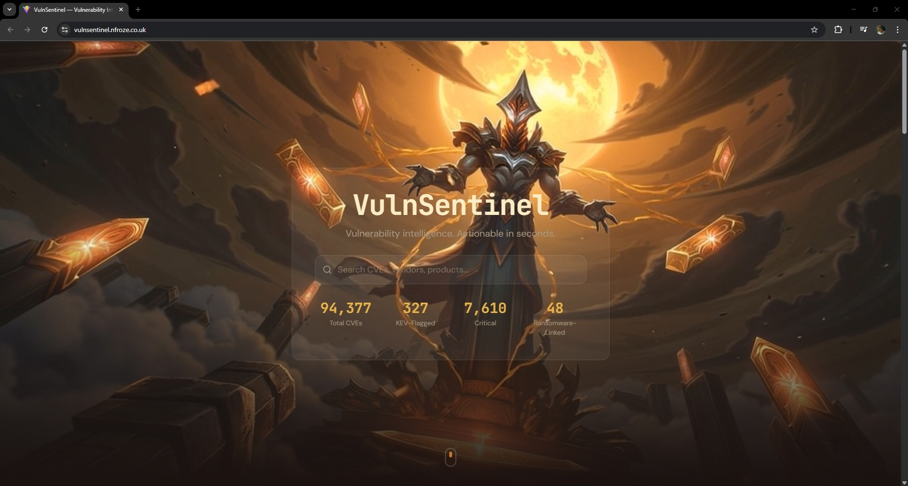

# VulnSentinel

**Live:** [vulnsentinel.nfroze.co.uk](https://vulnsentinel.nfroze.co.uk)

A vulnerability intelligence dashboard that fuses NVD and CISA KEV feeds into a single visual triage interface — turning two government JSON feeds into actionable threat context in seconds.

## Overview

Security teams face an impossible signal-to-noise problem. Over 40,000 new CVEs are disclosed annually, but only a fraction are actively exploited. CISA's Known Exploited Vulnerabilities catalog is the closest thing to a "patch this now" priority list, but it ships as a flat JSON feed with no severity mapping, no vendor aggregation, and no trend visualisation. Analysts are left cross-referencing spreadsheets.

VulnSentinel merges the NVD CVE 2.0 API with the CISA KEV catalog into a single searchable interface. A daily Lambda sync ingests two years of CVE data, enriches each entry with KEV status and ransomware campaign associations, and writes everything to DynamoDB. The frontend renders severity distributions, vendor heatmaps, KEV timelines, and a filterable CVE table with expandable detail rows and CSV export — all served from S3 behind Cloudflare SSL.

This project was produced by Jarvis, an automated build pipeline: concept brief, AI-generated hero art, cinemagraph animation, dark glassmorphic frontend, serverless infrastructure, and deployment — single pass, no manual intervention.

## Architecture

The system runs entirely serverless on AWS. An EventBridge rule triggers the sync Lambda daily at 02:00 UTC, which fetches the full CISA KEV catalog (~1,500 entries) and paginates through the NVD CVE 2.0 API in 2,000-result batches across 119-day date windows. Each CVE is enriched with KEV metadata (exploitation status, ransomware association, remediation deadlines) and batch-written to a single DynamoDB table.

The API Lambda sits behind API Gateway and serves four endpoints: paginated CVE search, individual CVE detail, aggregated dashboard statistics, and CSV export. Search queries are routed to the appropriate GSI (vendor, severity, CWE, or KEV index) to avoid full table scans on filtered requests. The stats endpoint performs a projected scan and computes all aggregations server-side — severity distribution, top vendors, top CWEs, KEV additions by year, and ransomware count — in a single response.

The React frontend is statically hosted on S3 with Cloudflare DNS providing SSL termination. A looping cinemagraph video serves as the hero background, with glassmorphic UI panels layered over it using `backdrop-blur` compositing.

## Tech Stack

**Frontend:** React 19, TypeScript, Vite 7, Tailwind CSS v4, Recharts, shadcn/ui components

**Backend:** AWS Lambda (Node.js 20), API Gateway REST, DynamoDB (on-demand, 4 GSIs)

**Infrastructure:** Terraform, S3 static hosting, EventBridge cron, Cloudflare DNS (proxied CNAME)

**Data Sources:** NVD CVE 2.0 API, CISA KEV JSON feed

**Design:** Dark glassmorphism, animated cinemagraph hero, JetBrains Mono + DM Sans typography, custom amber/ember palette

## Key Decisions

- **Single DynamoDB table with four GSIs over a relational database:** On-demand billing keeps costs near zero at low query volumes while GSIs on vendor, severity, CWE, and KEV status eliminate full scans for the most common filter operations. Trade-off: the stats endpoint still requires a projected scan, but limiting to six attributes keeps read units low.

- **119-day date windows for NVD ingestion:** The NVD API caps responses at 10,000 results per date range. Chunking the two-year lookback into 119-day windows stays safely under that limit while minimising the number of API round-trips. Rate limiting adapts based on whether an API key is present (700ms vs 6.5s between requests).

- **Server-side stats aggregation over client-side computation:** The `/api/stats` endpoint computes all dashboard metrics in a single Lambda invocation rather than shipping raw data to the browser. This keeps the frontend response under 2KB regardless of how many CVEs are in the database.

- **S3 + Cloudflare over CloudFront:** Cloudflare's proxied CNAME provides free SSL termination and caching without the configuration overhead or cost of a CloudFront distribution. Monthly hosting cost stays under $3.

## Screenshots

## Built By

**Jarvis** — AI build system designed by [Noah Frost](https://noahfrost.co.uk)

This project was produced through an automated end-to-end pipeline: brief, hero art, cinemagraph, build spec, deployed webapp. One shot. No manual intervention.

&rarr; System architect: [Noah Frost](https://noahfrost.co.uk)
&rarr; LinkedIn: [linkedin.com/in/nfroze](https://linkedin.com/in/nfroze)
&rarr; GitHub: [github.com/nfroze](https://github.com/nfroze)
